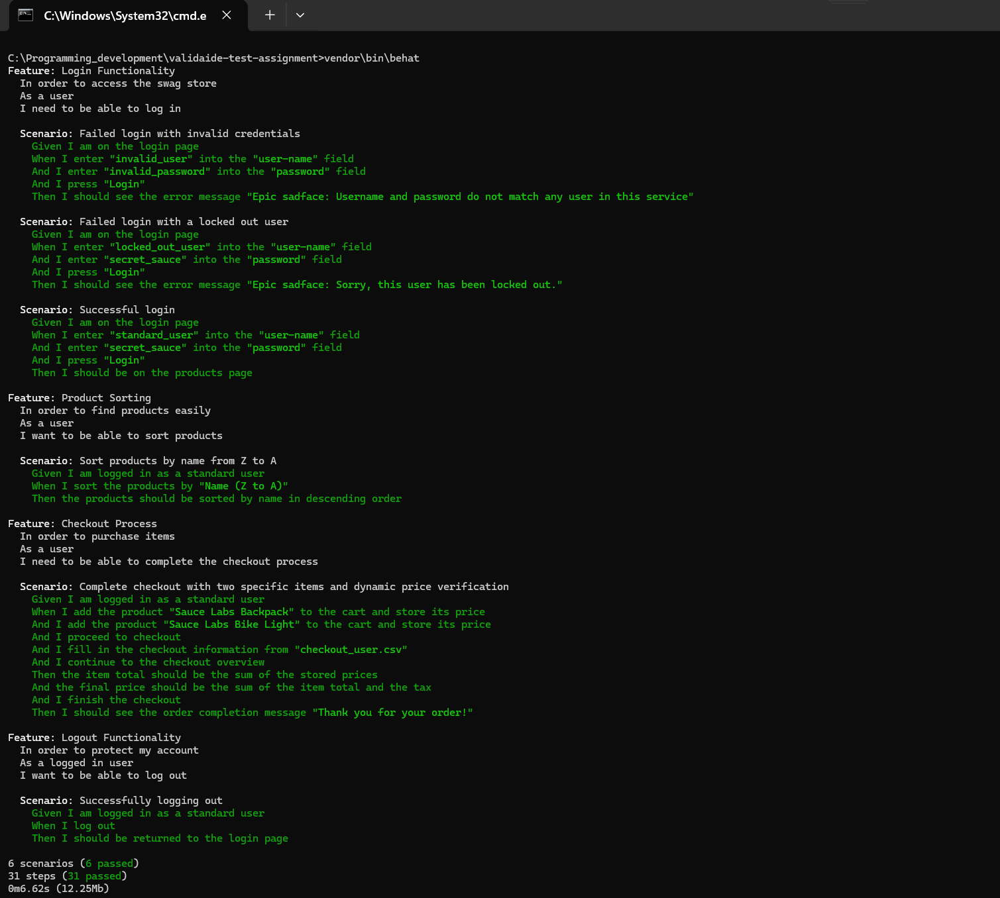

# Validaide Test Assignment – Swag Labs Automation

## 📌 Project Overview

This project is a Behavior-Driven Development (BDD) test suite for [SauceDemo.com](https://www.saucedemo.com/), a demo e-commerce site provided by Sauce Labs. The tests were written using **PHP**, **Behat**, and **Selenium** to validate the Swag Labs platform functionality, simulating a user journey from login to checkout and logout.

---

## ✅ Assignment Summary

The following test scenarios were implemented as per the assignment requirements:

### 1. 🔐 Login Functionality
- ❌ Failed login with invalid credentials
- 🔒 Failed login with a locked-out user
- ✅ Successful login with a standard user
- 📢 Verified appropriate error messages for failed scenarios

### 2. 🔃 Product Sorting
- 🔠 Sorted products by name from Z to A
- ✔️ Verified the sorting order is descending (Z to A)

### 3. 🛒 Checkout Process
- ➕ Added two items to the cart: Sauce Labs Backpack and Sauce Labs Bike Light
- 💰 Verified total price and tax calculations
- 🧾 Completed the checkout process with user information
- 🎉 Verified order confirmation message

### 4. 🚪 Logout Functionality
- ✅ Verified that the user is logged out and returned to the login page

---

## 🧪 Test Results

```
6 scenarios (6 passed)
31 steps (31 passed)
0m6.62s (12.25Mb)
```

Each scenario executed successfully using Behat, verifying both UI behavior and business logic with Selenium.

---

## 🛠️ Setup & Execution Instructions

### 🔧 Prerequisites
- PHP 8.x
- Composer
- Selenium Server (or a Selenium-compatible driver)
- ChromeDriver or GeckoDriver
- Git

### 📥 Installation
1. Clone the repository:
   ```bash
   git clone https://github.com/SrinivasaRaghavanSelvam/Validaide-Test-Assignment-1.git
   cd validaide-test-assignment
   ```

2. Install dependencies via Composer:
   ```bash
   composer install
   ```

3. Start Selenium server (headless or visible as preferred).

### ▶️ Run Tests
```bash
vendor/bin/behat
```

Tests will launch a browser session (or headless if configured) and execute all defined features and scenarios.

---

## 🧾 Notes
- Tests are organized using Gherkin syntax for clarity.
- Step definitions are implemented in `FeatureContext.php`.
- Includes dynamic price handling and checkout validation.
- Fully automated and can be extended easily for more scenarios.

---

## 🔗 GitHub Repo
https://github.com/SrinivasaRaghavanSelvam/Validaide-Test-Assignment-1

---

© 2025 | Automation Test Suite by Srinivasa Raghavan Selvam


---

## 📄 Test Plan

For a detailed explanation of the testing scope, approach, tools, and test scenarios, please refer to the [Test Plan](docs/Test_Plan.md).


## 🖼️ Test Execution Screenshot

Below is a screenshot of the test results confirming successful execution of all scenarios:


